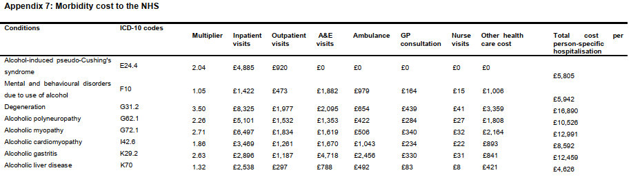

Duncan Gillespie, Laura Webster^1^, Colin Angus \& Alan Brennan

\vskip 1em

School of Health and Related Research (ScHARR), The University of Sheffield  

^1^ Contributed to methods development but has since left the research team

\vskip 1em

**Address for correspondence**:\

The data and code is currently being maintained by\

Dr Duncan Gillespie\
Section of Health Economics and Decision Science,\
School for Health and Related Research,\
The University of Sheffield,\
Regent Court, Regent Street, Sheffield, S1 4DA, UK\
Email: [duncan.gillespie\@sheffield.ac.uk](mailto:duncan.gillespie@sheffield.ac.uk){.email}


\vskip 1em

This document is produced by RMarkdown in the following repository accessible only to the project team https://gitlab.com/stapm/model-inputs/hosp_eng_methods_report.git.  

\vskip 1em

This document is licensed to The University of Sheffield under a [CC by 4.0](https://creativecommons.org/licenses/by/4.0/) license.   

\newpage


```{r setup, include = FALSE, results = 'hide', warning = FALSE}

knitr::opts_chunk$set(
  collapse = TRUE,
  comment = "#>",
  fig.pos = 'H'
)

options(tinytex.verbose = F)

#.libPaths("C:/Users/cm1dog/Documents/R")

suppressPackageStartupMessages(library(magrittr))
suppressPackageStartupMessages(library(knitr))
suppressPackageStartupMessages(library(kableExtra))
suppressPackageStartupMessages(library(data.table))
suppressPackageStartupMessages(library(ggplot2))
suppressPackageStartupMessages(library(readxl))
#suppressPackageStartupMessages(library(tobalcepi))
#suppressPackageStartupMessages(library(stapmr))
#suppressPackageStartupMessages(library(smktrans))
suppressPackageStartupMessages(library(ggthemes))
suppressPackageStartupMessages(library(RColorBrewer))
suppressPackageStartupMessages(library(cowplot))
suppressPackageStartupMessages(library(bookdown))

```

```{r include=FALSE, eval=F}
# automatically create a bib database for R packages
knitr::write_bib(c(
  .packages(), 'bookdown', 'knitr', 'rmarkdown'
), 'packages.bib')
```
 

\hypersetup{linkcolor=blue}
\tableofcontents

\newpage

# Background
The UK's National Health Service (NHS) has a high demand for inpatient and day case secondary care and much of this demand is potentially preventable by reducing public exposure to the harmful effects of tobacco and alcohol consumption. Being able to link past tobacco and alcohol consumption to current demand for secondary care is an important part of informing policymakers of the potential health and economic consequences of policy decisions that could affect tobacco and/or alcohol consumption. Estimating how demand for secondary care related to tobacco and alcohol consumption is distributed by age, sex and indicators of socioeconomic deprivation is also important for informing the potential effects of public policy on societal inequalities in health.    

This document explains the approach used to estimate the rates, numbers and costs of hospital admissions related to tobacco and/or alcohol to inform the Sheffield Tobacco and Alcohol Policy Modelling (STAPM; https://stapm.gitlab.io/). The method builds on the approach used to inform the Sheffield Alcohol Policy Model [@Brennan2009;@Brennan2015], which has produced estimates of policy effects on hospital admissions and costs for all countries in the UK (https://sarg-sheffield.ac.uk/publications). The STAPM programme of work investigates the past trends in hospital admissions and costs associated with tobacco and alcohol consumption to allow evaluation of the effects of past policy and the appraisal of the potential effects of new policy. The STAPM modelling currently uses hospital episode statistics for England (https://stapm.gitlab.io/hes_data_england.html) and Scotland (https://stapm.gitlab.io/hes_data_scotland.html).   

The STAPM modelling uses a defined a set of health conditions that have been classed as wholly- or partially-attributable to the consumption of tobacco and/or alcohol (see the [page on the STAPM website for the relative risks of diseases related to tobacco and/or alcohol consumption](https://stapm.gitlab.io/relative_risks.html). The current list of conditions is large (84 separate ICD-10 categories in total) and includes several cancers, cardiovascular diseases and respiratory diseases. The list includes 52 diseases related to tobacco [@Webster2018] and 45 diseases related to alcohol [@Angus2018] (expanded to 48 conditions by splitting categories to produce finer groupings that align with the definition of tobacco related diseases). Within the combined list of tobacco and/or alcohol related diseases, there are 15 conditions that are related to both tobacco and alcohol.   

Population attributable fractions (PAFs) are the proportion of cases of a disease or the proportion of deaths from a disease that could be prevented if harmful exposure to a disease risk-factor such as tobacco and alcohol was eliminated (see the [page on the STAPM website for our estimated fractions of disease attributable to tobacco and/or alcohol consumption](https://stapm.gitlab.io/PAFs.html). PAFs are calculated in the STAPM modelling using: (1) the relative risks of disease corresponding to different levels of tobacco and/or alcohol consumption, and (2) the population prevalence of each level of tobacco and/or alcohol consumption.   

Further reading: 

- [Statistics on alcohol for England](https://digital.nhs.uk/data-and-information/publications/statistical/statistics-on-alcohol)
- [Statistics on smoking for England](https://digital.nhs.uk/data-and-information/publications/statistical/statistics-on-smoking)
- [Alcohol related hospital statistics for Scotland](https://publichealthscotland.scot/publications/alcohol-related-hospital-statistics/alcohol-related-hospital-statistics-scotland-financial-year-2020-to-2021/)
- [Hospital admissions attributable to smoking for Scotland](https://www.scotpho.org.uk/behaviour/tobacco-use/data/smoking-attributable-admissions/)
- [Cost of Smoking to the NHS in England: 2015](https://www.gov.uk/government/publications/cost-of-smoking-to-the-nhs-in-england-2015/cost-of-smoking-to-the-nhs-in-england-2015)
- Allender S, Balakrishnan R, Scarborough P, Webster P, Rayner M. The burden of smoking-related ill health in the UK. Tobacco control. 2009 Aug 1;18(4):262-7. http://dx.doi.org/10.1136/tc.2008.026294
- Scarborough P, Bhatnagar P, Wickramasinghe KK, Allender S, Foster C, Rayner M. The economic burden of ill health due to diet, physical inactivity, smoking, alcohol and obesity in the UK: an update to 2006–07 NHS costs. Journal of Public Health. 2011 Dec 1;33(4):527-35. https://doi.org/10.1093/pubmed/fdr033
- Webster L, Angus C, Pryce R, Jones M, Brennan A, Britton J, Gillespie D (2018) Sections 3.2 to 3.5 - Estimates of the costs of tobacco to secondary care in England for the general adult population (3.2), and via the effects of maternal smoking during pregnancy (3.3), passive smoking effects on child health (3.4), and surgical complications due to smoking (3.5). Tobacco Advisory Group of the Royal College of Physicians. ‘Hiding in plain sight: Treating tobacco dependency in the NHS’, London: Royal Society of Physicians. https://www.rcplondon.ac.uk/projects/outputs/hiding-plain-sight-treating-tobacco-dependency-nhs   

# The purpose of this document
This document explains the approach taken to estimate the rates, numbers and costs of hospital admissions for the STAPM modelling. An explanation of the approach taken for the STAPM modelling is needed because the general cost-of-disease literature contains several different approaches, there are differences in the past approaches taken between investigations with a tobacco vs. an alcohol related disease focus, and different approaches have been taken in England compared to Scotland. This document is a way to transfer the knowledge of how to analyse hospital episode statistics within the STAPM modelling team, and it is a way for users of the STAPM modelling to understand the methods used.  

# Learning outcomes
Be able to explain:  

- The "narrow" and "broad" methods (and their variants) for assigning the cause of a hospital admission to a single tobacco and/or alcohol related condition.
- How to estimate the costs of hospital admissions that are attributed to a tobacco and/or alcohol related disease.


# Preliminaries   

To be able to access the datasets and code you will need access to:  

- The University of Sheffield ScHARR X-drive folder: `X:\ScHARR\PR_HES_data_TA`.
- The STAPM Gitlab code repository https://gitlab.com/stapm.
- The secure access virtual machine `heta_study`.
- To access the STAPM management documents, you will also need added to the STAPM Google Drive folder.

Access to the sensitive hospital episode datasets is restricted to only members of the project team who need it to fulfill the purposes for use of the data stated on the relevant data access agreements. Information governance procedures, which include completing relevant information governance training, follow the ScHARR Information Governance Policy https://www.sheffield.ac.uk/scharr/research/information-governance/scharr-information-governance-policy.  

Processing of the data uses functions in the `hesr` R package (https://stapm.gitlab.io/r-packages/hesr/) and `tobalcepi` R package (https://stapm.gitlab.io/r-packages/tobalcepi/).   

Code repositories:  

- [General data cleaning processes for English Hospital Episode Statistics](https://gitlab.com/stapm/model-inputs/hosp_eng_data_cleaning)
- [Process English Hospital Episode Statistics for tobacco and/or alcohol related conditions](https://gitlab.com/stapm/model-inputs/hosp_tobalc_eng_nat)
- [Processing of Scottish hospital episode statistics](https://gitlab.com/stapm/model-inputs/hosp_tobalc_scot_nat)


# Overview of the data used

**English hospital episode statistics for admitted patient care**  

Data is from the Admitted Patient Care (APC) component of the English Hospital Episode Statistics (HES) for inpatients and day cases resident in England [@Herbert_2017]. The data is recorded at the "finished consultant episode" (FCE) level, with an episode being a period of care under a particular consultant specialty at a single hospital provider. An episode can be finished because the patient moves to the care of a different consultant specialty, is transferred to another hospital, is discharged to their place of residence or dies. A patient might therefore have more than one episode of care following an admission to hospital, most usually because they are transferred from one consultant speciality to another. Episodes are joined together to create "provider spells", which refer to a continuous period of time spent within a single hospital. However, one estimate was that 86.7\% of all spells only contained a single episode [@geue2012spoilt]. Provider spells can further be joined together to create "continuous inpatient spells" (CIPS), which refer to a continuous period of time spent in hospital across more than one care provider, i.e., CIPS include at least one hospital transfer.  

The key data fields needed for the STAPM modelling are the patient's clinical diagnoses, age, sex, and the Index of Multiple Deprivation quintile associated with their post-code of residence. Each episode in the English hospital episode statistics can be marked with up to twenty disease diagnosis codes using the ICD-10 disease classification system ([International Classification of Disease and Related Health Problems, 10th revision](https://icd.who.int/browse10/2010/en#/)). For each episode, the diagnosis code in the first position is known as the 'primary diagnosis', which indicates the diagnosis that accounted for the majority of the length of stay of the patient in hospital; the other diagnoses are referred to as comorbidities. Only records with complete data on the patient's date of admission to hospital, age, sex and Index of Multiple Deprivation quintile (IMDQ) are used. If a patient has multiple episodes of care within a year and changes age, sex or IMDQ within the year, then they are assigned the value for these characteristics that they had on their first admission of the year.   

- [Data page on the STAPM website for Hospital Episode Statistics - England](https://stapm.gitlab.io/hes_data_england.html)    


**Scottish General / Acute and Inpatient Day Case dataset (SMR01)**  

The Scottish equivalent dataset is the [General / Acute and Inpatient Day Case dataset (SMR01)](https://www.ndc.scot.nhs.uk/National-Datasets/data.asp?SubID=5), which collects episode level data on hospital inpatient and day case discharges from acute specialities from hospitals in Scotland. Note however, that each episode in the Scottish hospital episode statistics can be marked with up to only six disease diagnosis codes. 

- [Data page on the STAPM website for Hospital Episode Statistics - Scotland](https://stapm.gitlab.io/hes_data_scotland.html)    

# The "narrow" and "broad" methods for assigning the cause of a hospital admission to a single tobacco and/or alcohol related condition

All estimates of the numbers of admissions are stratified by disease, age, sex and Index of Multiple Deprivation quintiles.      

## The narrow method (and friends)

The 'narrow' measure looks at whether the primary diagnosis of an episode is related to tobacco and/or alcohol, or whether a tobacco and/or alcohol related external cause has been recorded within any of the list of diagnoses of the episode. External causes of injury, e.g. assault, do not feature as the primary diagnosis even though they are the real cause of the admission, which is why an additional scan of all diagnosis codes is needed. The rationale behind the narrow method is to select the condition that is most likely to be the cause of the episode, even though this might miss later diagnoses that end up being important reasons for the episode of care received. Looking across all the episodes of care in a CIPS that have been assigned a condition related to tobacco and/or alcohol, a single condition must then be assigned as the cause of the entire CIPS. The literature indicates four approaches to do so:   

- 1a. Assign the CIPS the condition with the largest population attributable fraction (PAF) of disease. If this results in more than one diagnosis because two conditions have the same PAF, then the diagnosis of the earlier episode in the CIPS is used. Green [-@Green_2017] analysed trends in alcohol-related admissions to hospital by age, sex and socio-economic deprivation in England using this approach.    

- 1b. Assign the CIPS the diagnosis of the earliest episode in the CIPS that has been assigned a tobacco and/or alcohol related diagnosis. This is the same as 1a but without reliance on estimated population attributable fractions of disease. The rationale behind choosing the diagnosis of the earliest episode is that earlier episodes are more likely to reflect the cause of the admission. This is the method that we applied to estimate the cost of tobacco to secondary care for Chapter 3 of the Royal College of Physician's report "Hiding in plain sight: Treating tobacco dependency in the NHS" [@RCP2018].   

- 2a. Assign the CIPS the condition from the admission (first) episode of the CIPS. The NHS Digital statistics on the number of hospital admissions attributable to smoking [@NHSDigitalTobacco2019] refer to the number of finished admission episodes that have a primary diagnosis related to smoking, i.e. the ICD-10 disease code that appears in the first position in the list of disease diagnoses associated with the admission episode. This method was also used in an analysis of the costs of smoking by Public Health England [@public2017cost].    

- 2b. Assign the CIPS the condition from the admission (first) episode of the CIPS, but scan the first three diagnostic positions of that episode to check if there is a condition related to tobacco and/or alcohol and if so use the first recorded condition. This method has been used in studies that aim to estimate the cost that certain diseases place on secondary care [@Keeping_2015;@hobbelen2016burden]. The approach of scanning the first three (or possibly more) diagnosis codes was designed to balance the risk of incorrectly excluding admissions as being attributable to a diagnosis by using too strict a definition against the risk of incorrectly including admissions not actually caused by the condition by using too broad a definition. Hobbelen et al [-@hobbelen2016burden] conducted sensitivity analyses to investigate how using the first three diagnostic positions compared to: (i) Using the primary diagnosis of the admission episode - this reduced the yearly number of attributed hospital admissions by 25\%; (ii) Using all diagnostic fields of the admission episode - this increased the yearly number of attributed hospital admissions by 3.4\%.   

The STAPM modelling currently uses approach 1b to apply the narrow method.  

\bigskip

## The broad method 

**Description of the method**  

The 'broad' measure looks across all the diagnoses associated with a CIPS and assigns the CIPS the diagnosis with the largest PAF, i.e. the diagnosis most strongly associated with tobacco and/or alcohol. If two or more diagnoses have the same PAF, then the earliest recorded diagnosis is used. This method is widely used to inform estimates of alcohol attributable hospital admissions [@jones2008alcohol]. The Sheffield Alcohol Policy Model (SAPM) also uses the broad method to estimate the baseline rates of hospitalisations; the broad method therefore underlies previous estimates of policy effects on alcohol attributable hospital admissions by the Sheffield Alcohol Policy Model [@Brennan2009;@Holmes2014;@Angus2016].     

The STAPM modelling uses the same approach previously used for SAPM to apply the broad method. Note however, that because the method relies on choosing the disease with the largest PAF, the estimates of hospital admissions obtained by the broad method will vary depending on whether the list of diseases considered contains only alcohol related diseases, only tobacco related diseases, or is the combined list of tobacco and alcohol related diseases.    

**Comparison with the narrow method**    

NHS Digital [@NHSDigitalAlcohol2019] explain that "The 'broad' measure is a better indicator of the total burden that alcohol has on health services as it takes more account of secondary diagnoses than the 'narrow' measure^[This means that the broad measure would normally indicate a higher rate of hospital admissions for diseases related to tobacco and/or alcohol than the narrow measure]. However, since secondary diagnosis fields have become better populated over time^[The number of possible diagnosis codes has increased from 14 to 20, and the clinical practice has changed so that more secondary diagnosis codes are being recorded.], this impacts upon time series comparisons for the 'broad' measure as increases can be partly due to an improvement in data quality rather than a real effect. Consequently, the 'narrow' measure is a better indicator of changes over time." For example in 2017/18, it was estimated that alcohol was the main reason for 2.1\% of all admissions to hospital using the narrow measure, but using the broad measure, it was estimated that 7.2\% admissions were linked to alcohol.      

**Partitioning people among single-morbidity health states**   

The approach used previously for SAPM went a step further with the broad method and categorised the people in the model into single morbidity health states [@Brennan2009]. This means that the modelling makes the conservative assumption that an individual can only have one disease related to tobacco and/or alcohol, i.e. individuals do not have multi-morbidities. To some extent, this helps to avoid the over-estimation of the health impacts of changes to tobacco and/or alcohol consumption when the broad method is used. It also avoids the computational difficulties of tracking individual transitions among multiple health states (given the list of 84 tobacco and/or alcohol related diseases considered). Health states in the model are defined as "person-specific single morbidity" (PSSM) states, which means that each individual in the model is assigned to either one of the tobacco and/or alcohol related diagnosis categories, or to "no tobacco or alcohol related diseases" [@Brennan2009].   

Individuals are assigned to a single tobacco and/or alcohol related health state for the year by looking across all the diagnoses assigned to the CIPS for that individual within the year and assigning the individual the diagnosis with the largest PAF, i.e. the diagnosis most strongly associated with tobacco and/or alcohol. If two or more diagnoses have the same PAF, then the earliest recorded diagnosis is used. Thus, if the same person was admitted on two separate occasions for oesophageal cancer during the year, then this person would be assigned to the "oesophageal cancer" PSSM state. If an individual is admitted on two different occasions for two different reasons, first for oesophageal cancer and subsequently for lung cancer, then they would be assigned to the "lung cancer" PSSM state because lung cancer has the higher PAF. The proportion of people in each PSSM state in a year is calculated by dividing the number of people assigned to each PSSM state by the mid-year population size. A "multiplier" is then calculated, which gives the average number of CIPS in a year that individuals in each PSSM state would be expected to have, with the proviso that only CIPS assigned the same diagnosis as the individual's PSSM state are counted. This multiplier is used in the model to give the total number of CIPS expected to be associated with an individual in each PSSM state in a year.   

The current application of the broad method in the STAPM modelling follows this approach of partitioning people into PSSM states and calculating the corresponding multipliers.   

# Estimating the costs of hospital admissions that are attributed to tobacco and/or alcohol consumption  

## The SAPM approach to estimating the cost of treating alcohol related diseases

The approach taken for the original Sheffield Alcohol Policy Model (SAPM) in 2008 was to estimate the total annual cost to the NHS of having an alcohol related disease [see @Brennan2009, Section 2.5.5.4, p78]. Total annual costs to the NHS were derived from work by the Department of Health on NHS costs of alcohol related diseases that was recent at the time of SAPM development [@alccostdh2008]. The total NHS costs of most conditions was broken down by type of consultation/service though the SAPM team had to apportion some costs using the expert opinion of clinical colleagues. This resulted in a breakdown of NHS costs of alcohol related diseases by hospital inpatient and day visits, hospital outpatient visits, accident and emergency visits, ambulance services, NHS GP consultations, practice nurse consultations, dependency prescribed drugs, specialist treatment services and other health care costs (Figure \@ref(fig:morbcosttab)). The apportionment of cost by type of consultation/service was calibrated to sum to the Department of Health's estimated total cost of alcohol related diseases to the NHS [@alccostdh2008].   

This original SAPM approach to estimating the annual cost to the NHS of someone having an alcohol related disease was designed to work with the broad method of calculating person specific single morbidity (PSSM) hospital admissions; it has been applied in conjunction with that method in several reports and publications [e.g. @Holmes2014;@Angus2016].   

```{r morbcosttab, echo = F, out.width = "110%", fig.cap="Excerpt from `Appendix 7. Morbidity cost to the NHS' p204 of Brennan et al (2008) `Modelling the Potential Impact of Pricing and Promotion Policies for Alcohol in England: Results from the Sheffield Alcohol Policy Model'"}

```

\bigskip

## The current STAPM approach to estimating the cost of treating tobacco and/or alcohol related diseases

The approach taken currently for the Sheffield Tobacco and Alcohol Policy Modelling (STAPM) is to estimate the cost to the NHS of an admission to hospital either for an inpatient stay or a day visit. The STAPM approach therefore differs from the previous SAPM approach by not attempting to estimate the total annual cost of a person having a tobacco and/or alcohol related disease, but instead estimating the unit cost of a tobacco and/or alcohol related hospital admission. This means that the STAPM approach only considers the cost component in the "inpatient visits" column of Figure \@ref(fig:morbcosttab) and updates this cost estimate using a new method (described below). The change of approach between the previous SAPM and new STAPM modelling means that the modelled estimates of the cost of healthcare for alcohol related diseases will be lower for STAPM than they were for SAPM.    


### Review of methods for calculating the unit costs of tobacco and/or alcohol related hospital admissions

Four sources were reviewed to understand the available methods [@geue2012spoilt;@leal2018impact;@asaria2016using;@gaughan2012english]. The aim was to choose a method that estimated the component of the total cost of the admission that was due specifically to the diagnosis assigned to the admission without increasing this cost by including other costs incurred during the admission that were not specifically related to the diagnosis assigned to the admission. Three alternative methods were identified---Method 2 is the approach taken currently in the STAPM modelling.    

<!-- (Table \@ref(tab:table3)).    -->

```{r table3, eval = F, warning = F, echo=F, cache = F}

df_table3 <- readxl::read_xlsx('inst/cost_methods.xlsx','Sheet1')

df_table3 %>%
  kableExtra::kbl(booktabs = T, caption = "Three alternative methods to estimate the costs of hospital admissions that are attributed to tobacco and alcohol consumption.", label = "table3", linesep = "\\hline", escape = F, longtable = TRUE) %>%
  kableExtra::column_spec(column = 1, width = "5cm") %>%
  kableExtra::column_spec(column = 2, width = "10cm") %>%
  kableExtra::kable_styling(font_size = 8, latex_options = c("HOLD_position"))

```

\bigskip

**1. Cost the entire spell**  

An analysis of the costs of smoking to the NHS due to hospital admissions by Public Health England [@public2017cost] assigned admissions to a smoking related diagnosis based on the primary diagnostic position of the admission episode, and then estimated the cost of the admission as the cost of the full provider spell that followed. Costing was based on the provider spell level Healthcare Resource Group (HRG) classification of cost, using the hospital episode statistics data field "SUS generated core Spell HRG".    

Disadvantage of the approach: It might not be the most accurate or conservative method to fulfill our aim due to the mismatch between episode level and provider spell level costings [@leal2018impact]. The spell level HRG code could also count cost components unrelated to the tobacco and/or alcohol related diagnosis assigned to the spell using the method above.     

\bigskip

**2. Cost only the highest costing episode**   

For patients who had multiple episodes within a spell, a way to estimate the cost of the spell is to use the cost of the highest-costing episode as the cost of the spell [@geue2012spoilt;@asaria2016using]. Geue et al. [-@geue2012spoilt] then recommended adding the variable costs associated with other episodes within the same spell to this cost, e.g. the costs of excess bed days and of certain procedures that are not accounted for by the standard episode level HRG cost code.    

Disadvantage of the approach: Cost components unrelated to the tobacco and/or alcohol related diagnosis could influence the estimated cost of the spell. The cost of the spell might also be underestimated by not including the costs of all episodes related to tobacco and/or alcohol.  

\bigskip

**3. Cost all episodes with a relevant primary diagnosis**  

The method that we applied to estimate the cost of tobacco to secondary care for Chapter 3 of the Royal College of Physician's report [@RCP2018] retained all episodes within a spell that had a relevant diagnosis in the primary diagnostic position. The total cost of these episodes was calculated based on the episode level HRG code and the costs of episodes summed. This method was conservative by only counting the cost of episodes with a smoking-related primary diagnosis. Using this approach, the cost of an admission to hospital would be calculated by summing the costs of all episodes within a CIPS that have a primary diagnosis that matches the diagnosis assigned to the CIPS. This would mean excluding all costs associated with episodes of care within the CIPS that do not have a matching diagnosis code.      

Disadvantage of the approach: The spell-level HRG code can be associated with a cheaper reference cost than the sum of the episode-level HRGs, e.g. because the episode-level costs might double-count some of the costs associated with a spell.    


### The method of assigning costs to episodes of care

Healthcare Resource Group (HRG) grouper software is used to assign an HRG code to every epispde of care. The software assigns an HRG code based on diagnosis, procedure performed, gender, age, length of stay, and the discharge method. Additional variable costs might then be added to account for long stays in hospital and some procedures that are not considered within the HRG algorithm. Unit costs associated with the episode level HRG codes are taken from national-level NHS reference costs [@NHSrefcosts], which are linked to the HRG code and the type of episode (elective, non-elective, day case, regular attender).   

\bigskip

**Additional variable cost: Excess bed days**   

A per diem costing is applied to excess bed days that occurred beyond the standard number of days anticipated for a given HRG (known as the "trim point" for bed days). Excess bed days are costed by calculating how many days over the trim point an episode lasted, multiplying this excess number of days by the unit cost of an excess bed day, and adding this value to the episode cost.     

\bigskip

**Additional variable cost: Unbundled costs**    

These costs account for the additional costs of treatment given to regular attenders, e.g. for chemotherapy or renal dialysis. These costs are generally high, related to a limited number of patients and reported separately by providers. For chemotherapy, radiotherapy and renal dialysis, many episodes have a zero-cost HRG code for same day treatment (there is no national tariff due to a wide regional variation in costs and practice [@Keeping_2017]). For episodes with a primary diagnosis of cancer, we added chemotherapy and/or radiotherapy costs separately to the episode cost. For episodes with a primary diagnosis of chronic kidney disease or end-stage renal failure, we included additional renal dialysis costs.    

\bigskip

**Calculation of unit costs**   

Unit cost inputs to the STAPM modelling are the average costs of admissions attributed to each tobacco and/or alcohol related diagnosis category. The average costs an admissions for each disease category are calculated separately by age category, sex and Index of Multiple Deprivation (IMD) quintile. Cost estimates are currently calculated based on the year 2016/17 of the English hospital episode statistics and inflated to correspond to later years using the Hospital and Community Health Services (HCHS) pay and price inflation index [@curtis2016unit].    


# References


